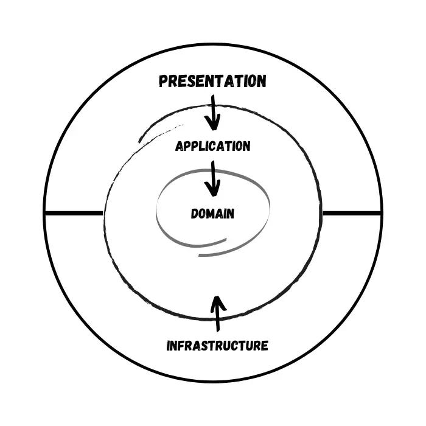

# ATech.MovieService

Example design of a .NET 8 service adopting the following paradigms and/or tools:

- [Clean Architecture](https://betterprogramming.pub/the-clean-architecture-beginners-guide-e4b7058c1165)
- [Domain Driven Design](https://martinfowler.com/bliki/DomainDrivenDesign.html)
- [CQRS](https://learn.microsoft.com/it-it/azure/architecture/patterns/cqrs)
- [MediaR](https://github.com/jbogard/MediatR)
- [.NET 8](https://dotnet.microsoft.com/it-it/download/dotnet/8.0)
- [Minimal APIs](https://learn.microsoft.com/en-us/aspnet/core/fundamentals/minimal-apis/overview?view=aspnetcore-8.0)
- [Entity Framework Core 8](https://learn.microsoft.com/en-gb/ef/)
- [FastEndpoints](https://fast-endpoints.com)
- [MongoDb](https://www.mongodb.com)

## Project Description

This project is an example of a possible implementation of some of the concepts, strategies and technologies, listed in the preface that, to date, I use in my services.

### Solution structure

The solution is structured around the concepts defined by clean architecture.

The image above is one of the possible representations of onion architecture. Each of the layers represented in the diagram corresponds to a project of the solution.

| Name                              | Description                                                                                                                       | Type     |
| :-------------------------------- | :-------------------------------------------------------------------------------------------------------------------------------- | :------- |
| ATech.MovieService.Domain         | The layer encapsulates the heart of the domain models and business logic.                                                         | classlib |
| ATech.MovieService.Application    | The Application layer manages business logic, harnessing the services of the Domain and Infrastructure layers.                    | classlib |
| ATech.MovieService.Infrastructure | Infrastructure manages database access and external services.                                                                     | classlib |
| ATech.MovieService.Api            | Presentation layer that enables interaction with users or external systems, using the services provided by the Application layer. | web      |
|                                   |                                                                                                                                   |          |